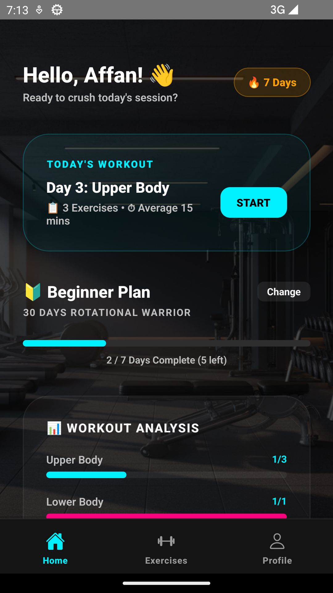
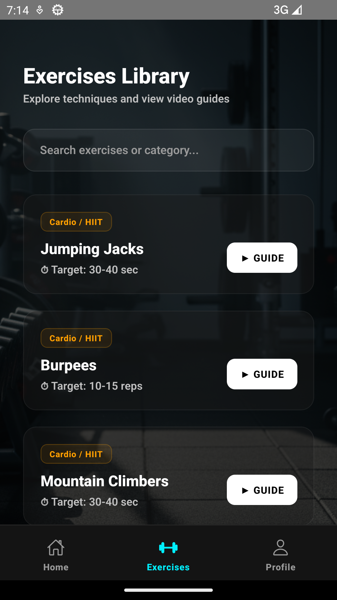
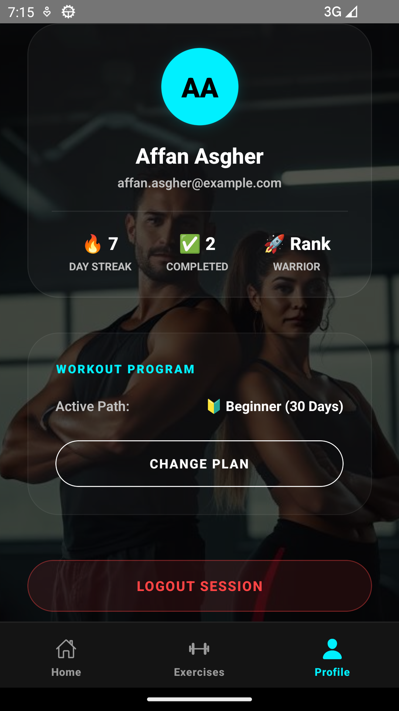
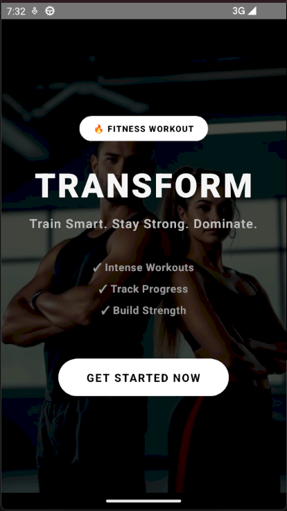
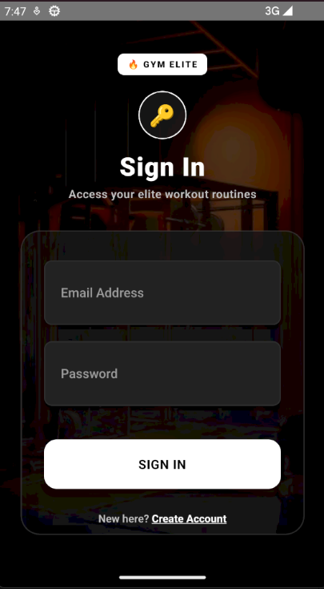
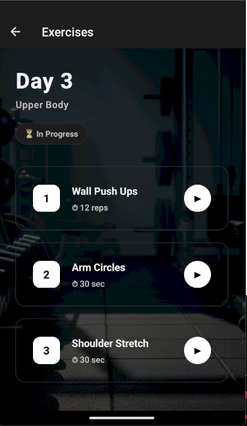
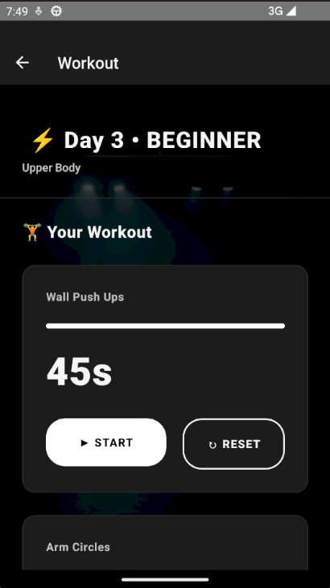

# 🏋️‍♂️ Fitness Tracking App

A premium, fully-featured React Native mobile application designed to help users track their fitness routines, choose tailored workout plans, visualize categories, and explore exercises with a sleek, futuristic bottom tab-based dark user interface.


---

## 📸 Screenshots

Here are actual high-resolution screenshots captured directly from the running production application:

### 🌟 Phase 1: Authentication & Discovery
| Login & Sign In | Premium Dashboard | Select Workout Plan |
| :---: | :---: | :---: |
|  |  |  |

### 🏋️‍♂️ Phase 2: Active Workouts & Analytics
| Workout Plan Details | Day Exercises Library | Interactive Timer | Profile & Ranks |
| :---: | :---: | :---: | :---: |
|  |  |  |  |

---

## 🌟 Key Features

- **👑 Dynamic Dashboard (Home Tab)**: Displays a warm personalized greeting (`"Hello, Affan! 👋"`), a glowing flame-themed streak counter card, today's current workout summary with quick-start actions, and the schedule outline.
- **📊 Interactive Data Visualization**: Features a high-fidelity category breakdown chart (Upper Body 🔵, Lower Body 🔴, Core 🟢, Cardio 🟡, Recovery 🟣) that dynamically calculates and renders your workout statistics in real-time.
- **🧭 Elevated Bottom Tab Navigator**: Custom-designed tab navigation using `@react-navigation/bottom-tabs` and Ionicons vector graphics. Highlighted with a vibrant active neon cyan accent state and elegant floating container drop-shadows.
- **🏋️‍♂️ Immersive Exercises Library (Exercises Tab)**: Full-featured directory with instant search filtering. Each exercise comes with target category badges and single-click video demonstration links.
- **👤 Modern Profile & Account Settings (Profile Tab)**: Displays initials inside a glowing avatar, tracks current active plan specifications, provides a ranked stats badge, and incorporates secure in-app session logout controls.
- **🎨 Ultra-Premium Dark Theme**: Polished grayscale theme featuring glassmorphism elements, custom backgrounds (`ScreenBackground`), glowing action buttons, and beautiful input cards.
- **🧠 Persistence & Session Recovery**: Utilizes `@react-native-async-storage/async-storage` to preserve active workout plans and historical completions across device restarts.

---

## 🛠️ Technical Stack & Architecture

- **Core Framework**: React Native (CLI v0.83)
- **Language**: TypeScript (100% strict type safety)
- **Navigation Flow**: React Navigation Stack paired with a core Bottom Tab Navigator
- **Icons**: React Native Vector Icons (Ionicons integration)
- **State & Storage**: In-memory lightweight authorization paired with AsyncStorage persistence
- **Local Assets**: High-resolution photorealistic workout illustrations matching localized require contexts

---

## 🚀 Pre-compiled App (Release APK)

A production-ready release-grade APK is pre-packaged and placed in the root of the workspace directory:
👉 **`fitness.apk`**

### Installation Guide:
1. Copy `fitness.apk` to your Android device.
2. Open the file on your device and install (ensure "Install from unknown sources" is enabled in your Android settings).
3. The app is completely self-contained—no local Metro server or computer connection is required to run it!

---

## 💻 Local Development Setup

### Prerequisites
- Node.js (v20+)
- Android Studio & Android SDK
- JDK 17+

### Steps
1. **Clone the repository and navigate to the project:**
   ```bash
   git clone <your-repo-url>
   cd FitnessApp/FitnessApp
   ```
2. **Install all dependencies:**
   ```bash
   npm install
   ```
3. **Start the Metro Bundler:**
   ```bash
   npx react-native start --reset-cache
   ```
4. **Compile and run on your Android Emulator:**
   In a separate terminal, launch:
   ```bash
   npm run android
   ```

---

## 🧠 Technical Challenges Solved

- **Android AAPT2 Resource Processing**: Resolved image compilation failures during release packaging by programmatically sanitizing color profiles and stripping metadata chunks using standard encoders.
- **Vector Icons Compilation Assets**: Integrated custom Gradle font-copy scripts into `android/app/build.gradle` to automate standard `.ttf` inclusion inside the APK.
- **Responsive Layout Architecture**: Tackled layout overflow and flex restrictions inside lists using dynamic `flexGrow` properties to ensure clean scrollability.

---

*Designed and developed by Affan Asgher*
